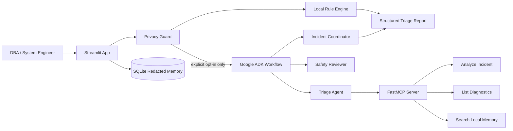

# SQL Server Incident Triage Agent

An AI-assisted incident triage application for SQL Server DBAs and system
engineers. The agent turns noisy SQL Server errors, job failures, replication
messages, deadlock reports, and Query Store findings into a structured,
safety-aware action plan.

This project was built for the **Kaggle AI Agents: Intensive Vibe Coding
Capstone Project**. It demonstrates a practical business use case for AI agents:
reducing the time required to understand database incidents while keeping human
DBA approval in the loop for operational actions.

Recommended Kaggle track: **Agents for Business**.

## What It Does

The app accepts an incident message or one of the included sample incidents and
returns:

- incident category
- severity
- likely cause
- verification steps
- recommended DBA actions
- read-only SQL checks
- privacy review
- optional Google ADK multi-agent analysis
- optional local memory search using redacted incident history

Supported incident patterns include:

- failed backups caused by disk space problems
- full transaction logs and `ACTIVE_TRANSACTION`
- SQL Agent or maintenance plan failures
- replication subscription issues
- Query Store / high CPU investigations
- SQL Server deadlocks
- general fallback guidance for unknown SQL Server incidents

## Why This Matters

SQL Server production incidents are often handled under pressure. A DBA may need
to read long logs, classify severity, identify the safest verification steps,
and avoid risky fixes such as shrinking files, killing sessions, or changing
replication configuration too early.

This agent is designed to help with the first triage phase:

- make incident response more consistent
- reduce time spent reading noisy logs
- separate observed facts from likely causes
- surface safe read-only checks
- require human review before operational action

The project is intended for demo and educational use. Do not connect it to a
production database without a security review and least-privilege credentials.

## Key Features

- **Local deterministic triage first**: the rule engine works without network
  access or an API key.
- **Google ADK workflow**: optional triage, safety-review, and coordination
  agents.
- **FastMCP server**: exposes read-only incident analysis, diagnostics listing,
  and memory search tools.
- **Privacy guardrails**: redacts sensitive-looking values before any optional
  external AI call.
- **Human-in-the-loop controls**: SQL checks are suggested for review, not
  executed by the UI.
- **Redacted local memory**: SQLite stores only redacted previews,
  classifications, and matched rule names.
- **Optional live SQL diagnostics**: disabled by default and restricted to named
  allowlisted read-only operations.
- **Tests included**: rules, redaction, memory, MCP integration, ADK workflow
  structure, and SQL allowlist behavior.

## Architecture

Static architecture asset: `assets/architecture.svg`

The design is local-first and safety-first:

1. The Streamlit app receives the incident text.
2. The privacy guard redacts configured sensitive values and limits input size.
3. The local rule engine creates a deterministic triage result.
4. If the user explicitly approves external AI sharing, the Google ADK workflow
   runs three agents:
   - `sql_triage_specialist`
   - `safety_reviewer`
   - `incident_coordinator`
5. The triage agent uses a local FastMCP server with read-only tools.
6. The UI displays the final report and records which SQL checks a DBA reviewed.

The ADK agent cannot execute the live SQL diagnostic tool. External MCP clients
can access live diagnostics only when explicitly enabled through environment
configuration. The server accepts named allowlisted operations only, never
arbitrary SQL.



## Capstone Concepts Demonstrated

| Course concept | Implementation |
| --- | --- |
| Agent / multi-agent system with ADK | `src/adk_workflow.py` |
| MCP server | `src/mcp_server.py` |
| Security features | `src/security.py`, Streamlit opt-in controls, SQL allowlist |
| Agent tool use | ADK triage agent calling MCP tools |
| Deployability | Public GitHub repository with setup instructions |

## Tech Stack

- Python
- Streamlit
- Google Agent Development Kit (ADK)
- Gemini model access through ADK
- FastMCP / Model Context Protocol
- SQLite
- pyodbc for optional SQL Server diagnostics
- pytest

## Project Structure

```text
sql-server-incident-triage-agent/
|-- app.py
|-- assets/
|   |-- architecture.svg
|   `-- cover.svg
|-- docs/
|   |-- ARCHITECTURE.md
|   |-- DEMO_VIDEO_SCRIPT.md
|   |-- KAGGLE_WRITEUP_TEMPLATE.md
|   `-- SUBMISSION_CHECKLIST.md
|-- prompts/
|-- sample_incidents/
|   |-- active_transaction_log_full.txt
|   |-- backup_failed_disk_full.txt
|   |-- deadlock_detected.txt
|   |-- query_store_high_cpu.txt
|   `-- replication_subscription_failed.txt
|-- src/
|   |-- adk_workflow.py
|   |-- agent.py
|   |-- mcp_server.py
|   |-- memory.py
|   |-- report.py
|   |-- rules.py
|   |-- security.py
|   `-- sqlserver_tools.py
|-- tests/
|-- .env.example
|-- requirements.txt
`-- README.md
```

## Setup

### 1. Create a virtual environment

Windows PowerShell:

```powershell
python -m venv .venv
.\.venv\Scripts\activate
```

Linux/macOS:

```bash
python3 -m venv .venv
source .venv/bin/activate
```

### 2. Install dependencies

```bash
pip install -r requirements.txt
```

### 3. Optional: configure ADK / Gemini

Copy `.env.example` to `.env`.

Windows PowerShell:

```powershell
copy .env.example .env
```

Linux/macOS:

```bash
cp .env.example .env
```

Then configure your local environment values:

```env
GOOGLE_API_KEY=
GEMINI_MODEL=gemini-2.5-flash
INCIDENT_MEMORY_PATH=data/incidents.db
SQLSERVER_MCP_ENABLE_LIVE=false
SQLSERVER_CONNECTION_STRING=
SQLSERVER_QUERY_TIMEOUT_SECONDS=10
```

If `GOOGLE_API_KEY` is not configured, the project still works using the local
rule-based triage engine.

## Run The App

```bash
streamlit run app.py
```

Typical workflow:

1. Paste an incident message or load a sample incident.
2. Choose whether to use the ADK workflow.
3. Optionally approve sharing redacted text with Gemini.
4. Optionally store the redacted incident in local memory.
5. Click **Analyze Incident**.
6. Review severity, category, likely cause, verification steps, privacy findings,
   ADK analysis, and SQL checks.
7. Record DBA approval for reviewed SQL checks.

## Run The MCP Server

The ADK workflow starts the MCP stdio server automatically. You can also run it
directly:

```bash
python -m src.mcp_server
```

Available tools:

- `analyze_incident`
- `list_sql_diagnostics`
- `run_sql_diagnostic`
- `search_incident_memory`

Live SQL diagnostics are disabled by default. If enabled, use a dedicated
least-privilege SQL Server login and never commit connection strings or
passwords.

## Run Tests

```bash
python -m pytest -q
```

The test suite covers:

- incident rule classification
- sample incident classification
- privacy redaction
- local memory behavior
- ADK workflow structure
- MCP tool metadata
- SQL allowlist validation

## Demo Flow

For a short demo or Kaggle video, use these samples:

1. `backup_failed_disk_full.txt`
2. `active_transaction_log_full.txt`
3. `replication_subscription_failed.txt`
4. `deadlock_detected.txt`

Show:

- the raw incident input
- privacy review and redacted preview
- severity and category
- likely cause
- verification steps
- read-only SQL checks
- human approval section
- optional ADK multi-agent response

Supporting submission materials:

- Kaggle writeup draft: `docs/KAGGLE_WRITEUP_TEMPLATE.md`
- demo video script: `docs/DEMO_VIDEO_SCRIPT.md`
- submission checklist: `docs/SUBMISSION_CHECKLIST.md`
- cover image: `assets/cover.svg`
- architecture image: `assets/architecture.svg`

## Security Notes

This project is intentionally conservative around database operations:

- The Streamlit app does not execute SQL.
- SQL checks are displayed for human DBA review only.
- External AI sharing is opt-in.
- Incident text is redacted before optional ADK/Gemini analysis.
- The MCP server does not accept arbitrary SQL.
- Live SQL diagnostics are disabled by default.
- Live diagnostics use named static queries, row limits, query timeouts, and a
  read-only ODBC connection.

Before using any SQL against production:

- review every query manually
- use least-privilege credentials
- avoid destructive commands
- do not shrink or repair files without backups and approval
- verify the redacted preview before approving external AI access

## Limitations

- The rule engine covers common SQL Server incident patterns, not every possible
  database failure mode.
- Optional ADK analysis requires a configured Google API key.
- Live SQL diagnostics require a compatible SQL Server ODBC setup and are not
  enabled by default.
- This project assists triage; it does not replace DBA judgment or change
  management.
