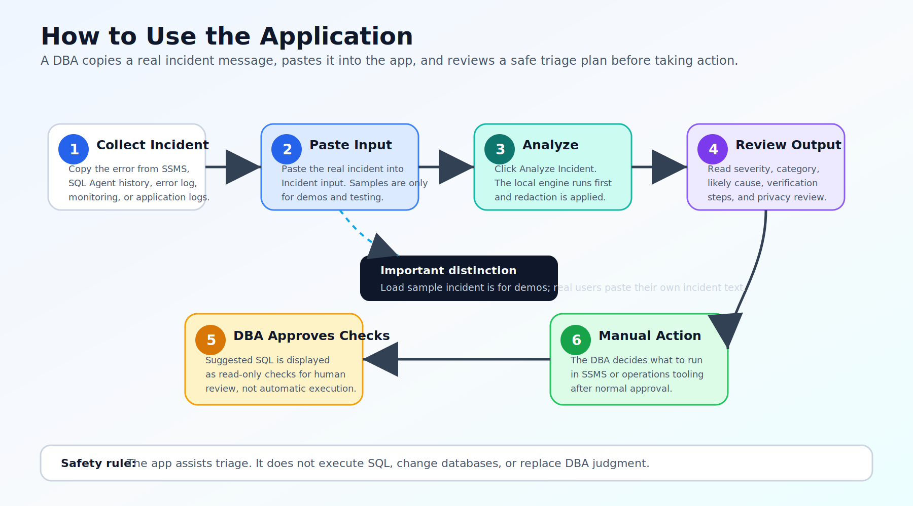
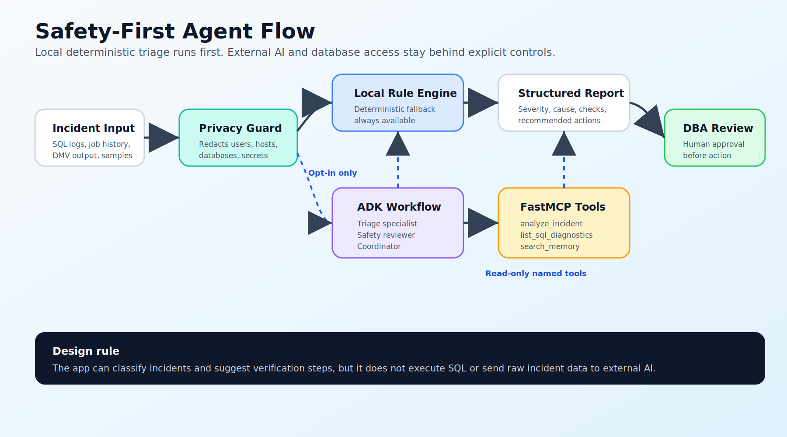
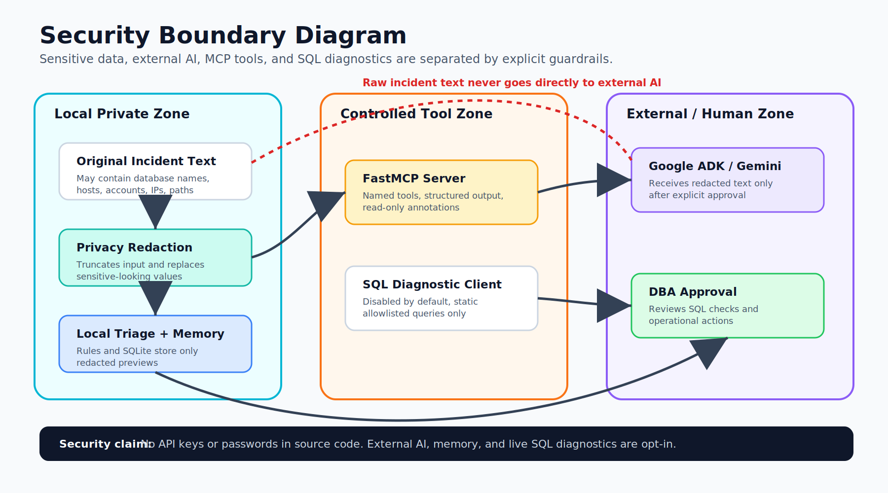
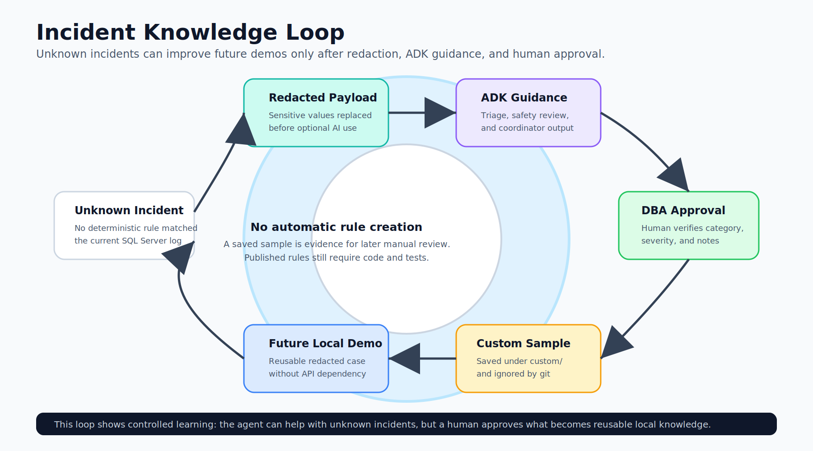
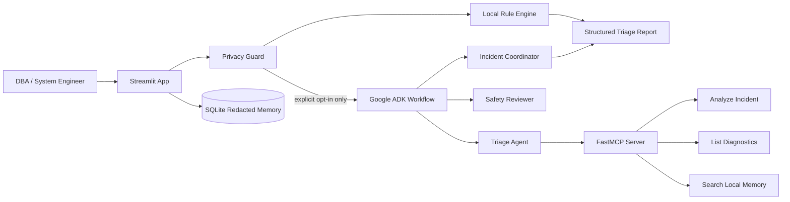

<div align="center">

# SQL Server Incident Triage Agent

## Kaggle AI Agents: Intensive Vibe Coding Capstone Project

**Author:** Arton Gerguri  
**Competition / Course:** AI Agents: Intensive Vibe Coding Capstone Project  
**Organizer:** Kaggle, in collaboration with Google  
**Recommended Track:** Agents for Business  
**Project Type:** AI-assisted SQL Server incident triage agent

</div>

## Project Overview

SQL Server Incident Triage Agent is an AI-assisted incident triage application
for SQL Server DBAs and system engineers. The agent turns noisy SQL Server
errors, job failures, replication messages, TempDB pressure, availability group
warnings, deadlock reports, and Query Store findings into a structured,
safety-aware action plan.

This project was developed as a capstone submission for the **Kaggle AI Agents:
Intensive Vibe Coding Capstone Project**. It demonstrates a practical business
use case for AI agents: reducing the time required to understand database
incidents while keeping human DBA approval in the loop for operational actions.

## What It Does

The app accepts an incident message or one of the included sample incidents and
returns:

- incident category
- severity
- likely cause
- verification steps
- recommended DBA actions
- read-only SQL checks
- privacy review
- optional Google ADK multi-agent analysis
- optional local memory search using redacted incident history

Supported incident patterns include:

- failed backups caused by disk space problems
- stale backups and recovery point risk
- full transaction logs and `ACTIVE_TRANSACTION`
- SQL Agent or maintenance plan failures
- replication subscription issues
- Query Store / high CPU investigations
- SQL Server deadlocks
- TempDB space pressure
- blocking chains and lock waits
- suspect databases and page checksum errors
- login failures and authentication issues
- Always On availability group synchronization problems
- SQL Server memory pressure
- connectivity and pre-login timeout errors
- transaction log autogrowth and VLF pressure
- general fallback guidance for unknown SQL Server incidents

## Why This Matters

SQL Server production incidents are often handled under pressure. A DBA may need
to read long logs, classify severity, identify the safest verification steps,
and avoid risky fixes such as shrinking files, killing sessions, or changing
replication configuration too early.

This agent is designed to help with the first triage phase:

- make incident response more consistent
- reduce time spent reading noisy logs
- separate observed facts from likely causes
- surface safe read-only checks
- require human review before operational action

## Key Features

- **Local deterministic triage first**: the rule engine works without network
  access or an API key.
- **Google ADK workflow**: optional triage, safety-review, and coordination
  agents.
- **FastMCP server**: exposes read-only incident analysis, diagnostics listing,
  and memory search tools.
- **Privacy guardrails**: redacts sensitive-looking values before any optional
  external AI call.
- **Human-in-the-loop controls**: SQL checks are suggested for review, not
  executed by the UI.
- **Redacted local memory**: SQLite stores only redacted previews,
  classifications, and matched rule names.
- **Optional live SQL diagnostics**: disabled by default and restricted to named
  allowlisted read-only operations.
- **Focused implementation comments**: safety-critical code paths explain the
  ADK tool boundary, privacy redaction, MCP read-only behavior, and SQL
  allowlist decisions.
- **Tests included**: rules, redaction, memory, MCP integration, ADK workflow
  structure, and SQL allowlist behavior.
- **Expanded scenario library**: 14 anonymized SQL Server incident samples for
  demos, testing, and Kaggle submission evidence.
- **User-approved custom samples**: unknown incidents can be saved locally as
  redacted reusable samples after ADK guidance and DBA/operator review.
- **Agent Skill runbook**: `skills/sql-server-incident-triage/SKILL.md`
  captures the reusable SQL Server triage procedure from the course's Agent
  Skills concept.

## Architecture

Static architecture assets for the README, Kaggle writeup, and video:

- `assets/architecture.svg`
- `assets/safety_first_agent_flow.svg`
- `assets/security_boundary_diagram.svg`
- `assets/incident_knowledge_loop.svg`
- `assets/how_to_use_app.svg`

### How to Use the Application



### Safety-First Agent Flow



### Security Boundary Diagram



### Incident Knowledge Loop



The design is local-first and safety-first:

1. The Streamlit app receives the incident text.
2. The privacy guard redacts configured sensitive values and limits input size.
3. The local rule engine creates a deterministic triage result.
4. If the user explicitly approves external AI sharing, the Google ADK workflow
   runs three agents:
   - `sql_triage_specialist`
   - `safety_reviewer`
   - `incident_coordinator`
5. The triage agent uses a local FastMCP server with read-only tools.
6. The UI displays the final report and records which SQL checks a DBA reviewed.

The ADK agent cannot execute the live SQL diagnostic tool. External MCP clients
can access live diagnostics only when explicitly enabled through environment
configuration. The server accepts named allowlisted operations only, never
arbitrary SQL.



## Capstone Concepts Demonstrated

| Course concept | Implementation |
| --- | --- |
| Agent / multi-agent system with ADK | `src/adk_workflow.py` |
| MCP server | `src/mcp_server.py` |
| Security features | `src/security.py`, Streamlit opt-in controls, SQL allowlist |
| Agent Skill / procedural memory | `skills/sql-server-incident-triage/SKILL.md` |
| Agent tool use | ADK triage agent calling MCP tools |
| Deployability | Public GitHub repository with setup instructions |

Code comments are intentionally focused on design and behavior decisions rather
than restating obvious Python syntax. The main commented areas are ADK tool
filtering, MCP read-only boundaries, privacy redaction, unknown-incident sample
creation, and SQL diagnostic allowlisting.

## Tech Stack

- Python
- Streamlit
- Google Agent Development Kit (ADK)
- Optional Gemini model access through ADK
- FastMCP / Model Context Protocol
- SQLite
- pyodbc for optional SQL Server diagnostics
- pytest

## Development Tools

- **Visual Studio Code**: primary IDE for editing, running, testing, and
  reviewing the Python project.
- **Google Antigravity IDE**: agentic development environment used for project
  review/refinement workflow and for demonstrating the course's vibe coding
  development approach.
- **GitHub**: public project repository and submission link.
- **pytest**: automated test runner for rule matching, privacy, MCP, ADK
  structure, memory, and SQL allowlist behavior.

## Project Structure

```text
sql-server-incident-triage-agent/
|-- app.py
|-- assets/
|   |-- architecture.svg
|   |-- cover.svg
|   |-- how_to_use_app.svg
|   |-- incident_knowledge_loop.svg
|   |-- safety_first_agent_flow.svg
|   `-- security_boundary_diagram.svg
|-- docs/
|   |-- ARCHITECTURE.md
|   |-- DEMO_VIDEO_SCRIPT.md
|   |-- KAGGLE_WRITEUP_TEMPLATE.md
|   `-- SUBMISSION_CHECKLIST.md
|-- prompts/
|-- sample_incidents/
|   |-- active_transaction_log_full.txt
|   |-- always_on_not_synchronizing.txt
|   |-- backup_chain_rpo_risk.txt
|   |-- backup_failed_disk_full.txt
|   |-- blocking_chain_lck_m_waits.txt
|   |-- connectivity_prelogin_timeout.txt
|   |-- database_suspect_page_checksum.txt
|   |-- deadlock_detected.txt
|   |-- login_failed_18456.txt
|   |-- memory_pressure_resource_semaphore.txt
|   |-- query_store_high_cpu.txt
|   |-- replication_subscription_failed.txt
|   |-- tempdb_space_pressure.txt
|   `-- transaction_log_autogrowth_vlf_pressure.txt
|-- src/
|   |-- adk_workflow.py
|   |-- agent.py
|   |-- mcp_server.py
|   |-- memory.py
|   |-- report.py
|   |-- rules.py
|   |-- security.py
|   `-- sqlserver_tools.py
|-- tests/
|-- skills/
|   `-- sql-server-incident-triage/
|       |-- SKILL.md
|       `-- references/
|-- .env.example
|-- requirements.txt
`-- README.md
```

## Setup

### 1. Create a virtual environment

Windows PowerShell:

```powershell
python -m venv .venv
.\.venv\Scripts\activate
```

Linux/macOS:

```bash
python3 -m venv .venv
source .venv/bin/activate
```

### 2. Install dependencies

```bash
pip install -r requirements.txt
```

### 3. Optional: configure ADK / Gemini

Copy `.env.example` to `.env`.

Windows PowerShell:

```powershell
copy .env.example .env
```

Linux/macOS:

```bash
cp .env.example .env
```

Then configure your local environment values:

```env
GOOGLE_API_KEY=
GEMINI_MODEL=gemini-2.5-flash
INCIDENT_MEMORY_PATH=data/incidents.db
SQLSERVER_MCP_ENABLE_LIVE=false
SQLSERVER_CONNECTION_STRING=
SQLSERVER_QUERY_TIMEOUT_SECONDS=10
```

If `GOOGLE_API_KEY` is not configured, the project still works using the local
rule-based triage engine.

## Run The App

If your virtual environment is active:

```bash
streamlit run app.py
```

If PowerShell does not recognize `streamlit`, run it through Python from the
virtual environment:

```powershell
.\.venv\Scripts\python.exe -m streamlit run app.py
```

Or activate the environment first, then run Streamlit:

```powershell
.\.venv\Scripts\activate
python -m streamlit run app.py
```

Typical workflow:

1. Copy an incident message from SSMS, SQL Agent Job History, SQL Server Error
   Log, monitoring, or application logs.
2. Paste the real incident text into **Incident input**.
3. Use **Load sample incident** only for demos, testing, or the Kaggle video.
4. Choose whether to use the ADK workflow.
5. Optionally approve sharing redacted text with Gemini.
6. Optionally store the redacted incident in local memory.
7. Click **Analyze Incident**.
8. Review severity, category, likely cause, verification steps, privacy
   findings, ADK analysis, and SQL checks.
9. Record DBA approval for reviewed SQL checks.
10. If needed, manually run reviewed SQL checks in SSMS or another trusted DBA
    tool. This app does not execute them.

## Learning From Unknown Incidents

If no local rule matches an incident, the app can optionally use the ADK/Gemini
workflow when `GOOGLE_API_KEY` is configured and the user approves sharing the
redacted incident text.

After a DBA or operator verifies that the ADK guidance is useful, the UI can save
a new redacted sample under:

```text
sample_incidents/custom/
```

This is intentionally approval-based:

- the app never sends incident text to external AI without opt-in
- the app saves only the redacted incident and reviewed notes
- custom samples are ignored by git through `.gitignore`
- saving a sample does not automatically create a new rule in `src/rules.py`

If the sample becomes generally useful, review it manually and add a proper
deterministic rule and test before publishing it.

## Run The MCP Server

The ADK workflow starts the MCP stdio server automatically. You can also run it
directly:

```bash
python -m src.mcp_server
```

Available tools:

- `analyze_incident`
- `list_sql_diagnostics`
- `run_sql_diagnostic`
- `search_incident_memory`

Live SQL diagnostics are disabled by default. If enabled, use a dedicated
least-privilege SQL Server login and never commit connection strings or
passwords.

## Run Tests

```bash
python -m pytest -q
```

The test suite covers:

- incident rule classification
- sample incident classification
- privacy redaction
- local memory behavior
- ADK workflow structure
- MCP tool metadata
- SQL allowlist validation

## Agent Skill Runbook

The project includes a formal Agent Skill-style runbook:

```text
skills/sql-server-incident-triage/SKILL.md
```

It documents how an agent should classify SQL Server incidents, use MCP tools
safely, keep SQL checks read-only, require DBA approval, and handle unknown
incidents. The supporting category reference is:

```text
skills/sql-server-incident-triage/references/incident_categories.md
```

This demonstrates the training concept of procedural memory: reusable expert
workflow instructions kept separate from application code.

## Demo Flow

The project includes 14 sample incidents. For a short Kaggle video, use a small
representative set:

1. `backup_failed_disk_full.txt`
2. `tempdb_space_pressure.txt`
3. `database_suspect_page_checksum.txt`
4. `deadlock_detected.txt`
5. `always_on_not_synchronizing.txt`

Show:

- the raw incident input
- privacy review and redacted preview
- severity and category
- likely cause
- verification steps
- read-only SQL checks
- human approval section
- optional ADK multi-agent response

Supporting submission materials:

- Kaggle writeup draft: `docs/KAGGLE_WRITEUP_TEMPLATE.md`
- demo video script: `docs/DEMO_VIDEO_SCRIPT.md`
- submission checklist: `docs/SUBMISSION_CHECKLIST.md`
- cover image: `assets/cover.svg`
- architecture image: `assets/architecture.svg`
- how-to-use image: `assets/how_to_use_app.svg`
- safety-first flow image: `assets/safety_first_agent_flow.svg`
- security boundary image: `assets/security_boundary_diagram.svg`
- incident knowledge loop image: `assets/incident_knowledge_loop.svg`

## Security Notes

This project is intentionally conservative around database operations:

- The Streamlit app does not execute SQL.
- SQL checks are displayed for human DBA review only.
- External AI sharing is opt-in.
- Incident text is redacted before optional ADK/Gemini analysis.
- The MCP server does not accept arbitrary SQL.
- Live SQL diagnostics are disabled by default.
- Live diagnostics use named static queries, row limits, query timeouts, and a
  read-only ODBC connection.

Before using any SQL against production:

- review every query manually
- use least-privilege credentials
- avoid destructive commands
- do not shrink or repair files without backups and approval
- verify the redacted preview before approving external AI access

## Limitations

- The rule engine covers common SQL Server incident patterns, but it is still a
  triage assistant rather than a complete observability platform.
- Optional ADK analysis requires a configured Google API key.
- Live SQL diagnostics require a compatible SQL Server ODBC setup and are not
  enabled by default.
- This project assists triage; it does not replace DBA judgment or change
  management.
