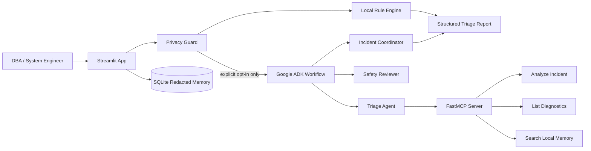

# SQL Server Incident Triage Agent

AI agent demo project for the Kaggle AI Agents / Vibe Coding Capstone.

This project helps a DBA or System Engineer analyze SQL Server incidents such as:

- failed backups
- full transaction log
- `log_reuse_wait_desc = ACTIVE_TRANSACTION`
- replication subscription errors
- Query Store / high CPU findings
- disk space problems
- SQL Agent job failures
- SQL Server deadlocks

The app gives a structured incident report:

1. incident category
2. severity
3. likely cause
4. verification steps
5. recommended fix steps
6. safe SQL checks
7. optional Google ADK multi-agent analysis

## Why this project is useful

SQL Server incidents can cause downtime, failed backups, replication delays, and service disruption. This agent helps reduce triage time by converting messy logs and error messages into a clear action plan.

This project is intended for demo and educational use. Do not connect it to a production database without review and security controls.

## Project track

Recommended Kaggle track: **Business Track**

Reason: database incidents directly affect uptime, cost, service reliability, and operational risk.

## Tech stack

- Python
- Streamlit
- Rule-based triage engine
- Google Agent Development Kit (ADK)
- Model Context Protocol (MCP) server
- Optional Gemini model access
- SQLite incident memory with redacted data only
- Optional allowlisted SQL Server diagnostics through `pyodbc`
- Sample incident files
- README and Kaggle writeup template

## Architecture

Static diagram asset: `assets/architecture.svg`

1. The local rule engine produces a deterministic result without network access.
2. The privacy guard removes configured sensitive values and limits input size.
3. After explicit user approval, an ADK `Workflow` runs the triage,
   safety-review, and coordination agents.
4. The triage agent uses the local FastMCP server for read-only tools.
5. Optional SQLite memory stores only redacted previews and classifications.

The ADK agent cannot execute the live SQL diagnostic tool. External MCP clients
can access it only when live access is explicitly enabled. The server accepts a
named allowlisted operation, never arbitrary SQL.



## Capstone concepts demonstrated

| Course concept | Where demonstrated |
| --- | --- |
| Agent / multi-agent system with ADK | `src/adk_workflow.py` |
| MCP server | `src/mcp_server.py` |
| Security features | `src/security.py`, Streamlit opt-in controls, SQL allowlist |
| Agent skills / tool use | ADK triage agent calling MCP tools |
| Deployability | Public GitHub setup instructions in this README |

## Setup

### 1. Create virtual environment

Windows PowerShell:

```powershell
python -m venv .venv
.\.venv\Scripts\activate
```

Linux/macOS:

```bash
python3 -m venv .venv
source .venv/bin/activate
```

### 2. Install dependencies

```bash
pip install -r requirements.txt
```

### 3. Optional: configure ADK / Gemini

Copy `.env.example` to `.env`:

```bash
copy .env.example .env
```

Add your API key locally:

```env
GOOGLE_API_KEY=
GEMINI_MODEL=gemini-2.5-flash
```

If no API key is provided, the project still works using the local rule-based triage engine.

Even with an API key, the app does not send incident text until the user enables
the approval checkbox. Only redacted, length-limited text is sent.

### 4. Run the app

```bash
streamlit run app.py
```

### 5. Run the MCP server directly

The ADK workflow starts this stdio server automatically. MCP clients can also
start it with:

```bash
python -m src.mcp_server
```

Available tools:

- `analyze_incident`
- `list_sql_diagnostics`
- `run_sql_diagnostic`
- `search_incident_memory`

Live SQL access is disabled by default. If it is enabled, use a dedicated SQL
login with only the documented read permissions and configure the connection in
`.env`. Do not place credentials in source code.

### 6. Run tests

```bash
python -m pytest -q
```

## How to use

1. Open the app.
2. Paste an SQL Server error message, job history, or incident log.
3. Or select one of the sample incident files.
4. Optionally approve sending redacted data to Gemini and/or local memory.
5. Click **Analyze Incident**.
6. Review privacy findings, local triage, and optional ADK analysis.
7. Record which SQL checks were reviewed by a human DBA.

## Suggested demo flow

Use these three examples:

1. `backup_failed_disk_full.txt`
2. `active_transaction_log_full.txt`
3. `replication_subscription_failed.txt`
4. `deadlock_detected.txt`

In the video, show:

- the raw incident text
- the agent analysis
- severity classification
- SQL verification queries
- recommended DBA actions

## Suggested Antigravity workflow

You can first build this project in VS Code, then open the same folder in Google Antigravity and ask it to improve one feature.

Example prompt for Antigravity:

```text
Open this project and add a new severity rule for SQL Server deadlock incidents.
Update the README and add one new sample incident file.
Keep the code simple and testable.
```

Then mention in your Kaggle video:

> The initial version was built in VS Code. I then opened the project in Google Antigravity and used it to refactor the triage rules and add one new incident type.

## Safety notes

The Streamlit app does not execute SQL commands. It suggests allowlisted,
read-only verification queries and records human approval separately.

The MCP server contains an optional live diagnostic tool. It is disabled by
default, accepts only named static queries, applies row/time limits, and opens
the ODBC connection in read-only mode. Database permissions remain the primary
security boundary.

Before running any SQL against production:

- review every query
- avoid destructive commands
- do not run shrink or repair commands without a backup and proper approval
- verify the redacted preview before approving external AI access
- use a dedicated least-privilege login for optional live diagnostics

## Folder structure

```text
sql-server-incident-triage-agent/
|-- app.py
|-- assets/
|-- requirements.txt
|-- src/
|   |-- adk_workflow.py
|   |-- agent.py
|   |-- mcp_server.py
|   |-- memory.py
|   |-- report.py
|   |-- rules.py
|   |-- security.py
|   `-- sqlserver_tools.py
|-- prompts/
|-- sample_incidents/
|-- docs/
`-- tests/
```

## License

MIT License. Use and modify freely for your capstone project.
