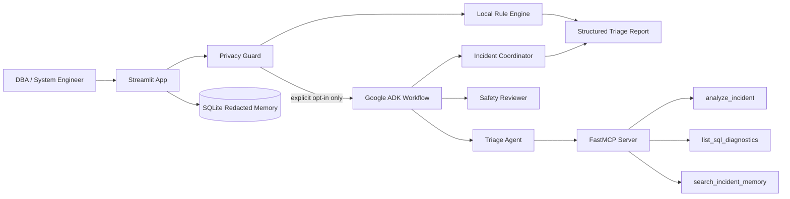

# Architecture

This project uses a conservative agent design: deterministic local triage runs
first, and the LLM-based ADK workflow is optional and gated by explicit user
approval.

Static diagram asset for the README, Kaggle writeup, or video:
`assets/architecture.svg`.

## Main design decisions

- The local rule engine works without network access and provides a stable
  fallback if ADK or Gemini is not configured.
- Incident text is treated as untrusted input. Sensitive-looking values are
  redacted before any optional external AI call.
- The ADK workflow uses three specialized agents: triage, safety review, and
  final coordination.
- The MCP server exposes named tools instead of arbitrary SQL execution.
- Live SQL diagnostics are disabled by default and require explicit environment
  configuration plus least-privilege database permissions.

## Data flow

1. User pastes an incident or loads a sample in Streamlit.
2. The privacy guard redacts secrets, users, hosts, databases, IPs, and paths.
3. The deterministic rule engine classifies the incident and generates safe
   verification steps.
4. If the user approves external AI access and `GOOGLE_API_KEY` is configured,
   the redacted incident is sent to the ADK workflow.
5. The triage agent can use read-only MCP tools for deterministic analysis,
   diagnostic discovery, and redacted memory search.
6. The safety reviewer checks the advice for unsupported claims, privacy risk,
   and unsafe operational actions.
7. The coordinator returns one concise DBA-facing response.
