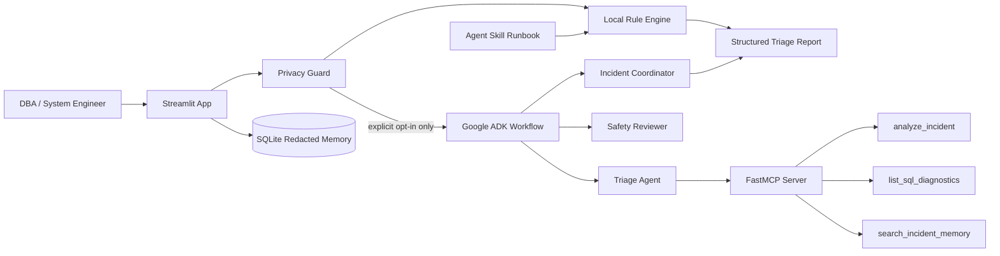

# Architecture

This project uses a conservative agent design: deterministic local triage runs
first, and the LLM-based ADK workflow is optional and gated by explicit user
approval.

Static diagram assets for the README, Kaggle writeup, or video:

- `assets/architecture.svg`
- `assets/how_to_use_app.svg`
- `assets/safety_first_agent_flow.svg`
- `assets/security_boundary_diagram.svg`
- `assets/incident_knowledge_loop.svg`

Use `assets/how_to_use_app.svg` to explain the real user workflow. Use
`assets/safety_first_agent_flow.svg` as the main high-level architecture
diagram. Use `assets/security_boundary_diagram.svg` when explaining security and
privacy. Use `assets/incident_knowledge_loop.svg` when explaining the optional
rule proposal workflow for unknown incidents.

## Main design decisions

- The local rule engine works without network access and provides a stable
  fallback if ADK or Gemini is not configured.
- Incident text is treated as untrusted input. Sensitive-looking values are
  redacted before any optional external AI call.
- The ADK workflow uses three specialized agents: triage, safety review, and
  final coordination.
- The MCP server exposes named tools instead of arbitrary SQL execution.
- The Agent Skill runbook keeps reusable SQL Server triage procedure separate
  from application code.
- Live SQL diagnostics are disabled by default and require explicit environment
  configuration plus least-privilege database permissions.
- Unknown incidents can be saved as local rule proposals only after redaction,
  ADK/operator review, and explicit user approval.
- Code comments document the design intent in safety-sensitive paths: ADK tool
  filtering, MCP read-only boundaries, privacy redaction, SQL allowlisting,
  local memory, and rule proposal storage.

## Data flow

1. User pastes an incident or loads a sample in Streamlit.
2. The privacy guard redacts secrets, users, hosts, databases, IPs, and paths.
3. The deterministic rule engine classifies the incident and generates safe
   verification steps.
4. The Agent Skill runbook documents the procedure and category reference used
   to keep triage behavior reviewable.
5. If the user approves external AI access and `GOOGLE_API_KEY` is configured,
   the redacted incident is sent to the ADK workflow.
6. The triage agent can use read-only MCP tools for deterministic analysis,
   diagnostic discovery, and redacted memory search.
7. The safety reviewer checks the advice for unsupported claims, privacy risk,
   and unsafe operational actions.
8. The coordinator returns one concise DBA-facing response.
9. If no local rule matched and the operator approves the reviewed guidance, the
   app can save a redacted proposed rule under `data/rule_proposals/`.

## Rule proposal workflow

The rule proposal workflow is intentionally separate from the active rule
engine. When `matched_rules` is empty, the UI can show **Propose a new rule**.
If ADK/Gemini guidance is available and the operator approves local storage, the
app saves a JSON proposal containing the redacted incident, proposed name,
category, severity, candidate keywords, reviewed notes, and review checklist.

The proposal does not modify `src/rules.py` and does not become active until a
developer/DBA manually reviews it, converts it into a `TriageRule`, and adds or
updates tests.
